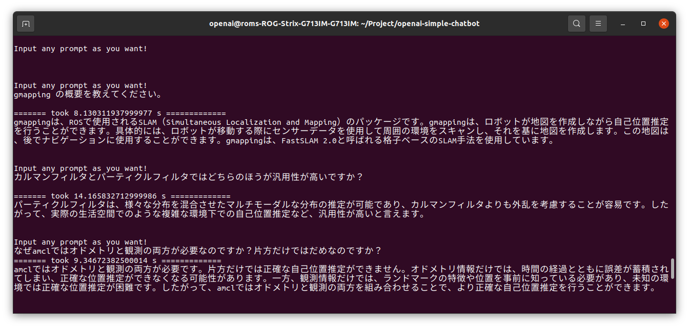

# openai-simple-chatbot
Simple chatbot sample with OpenAI API

# How to use
## Input your OpenAI API key
```bash
cd config
code config.yaml
```

- Edit `openai_api_key` in config.yaml

## Build docker image
```bash
cd docker-config
./docker-compose_build.sh
```

## Run docker container
```bash
cd docker-config
./docker-compose_run.sh
```

## With initial index
- Inside of docker container

```
~/Project/openai-simple-chatbot
python3 main.py --store True
```

## Without indexing
- Inside of docker container

```
~/Project/openai-simple-chatbot
python3 main.py --store False
```

## Talk with chatbot with any prompt!

